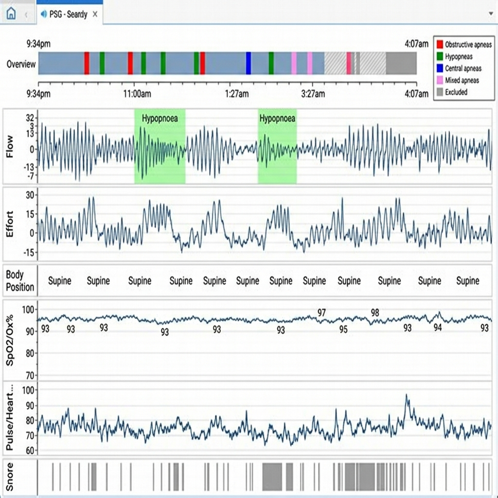

# 🛏️ Time Series Challenge: Intelligent Sleep Apnea Screening

> **Megawiz — Health-Tech Data Challenge**
> วิเคราะห์ข้อมูล Home Sleep Test (HST) เพื่อพัฒนาระบบคัดกรองภาวะหยุดหายใจขณะหลับอัตโนมัติ

---

## 📖 Business Context

บริษัท **Megawiz** ต้องการพัฒนาระบบคัดกรอง **Obstructive Sleep Apnea (OSA)** อัตโนมัติจากข้อมูล Home Sleep Test เพื่อลดภาระแพทย์เวชศาสตร์การนอนหลับ และเพิ่ม throughput ของคลินิก

### ปัญหา
- แพทย์ผู้เชี่ยวชาญต้องอ่านผล **ทีละราย** → ใช้เวลา 20-40 นาที/คน
- ผู้ป่วยรอผล **3-7 วัน** → delay ในการรักษา
- มีเพียง ~200 แพทย์เวชศาสตร์การนอนหลับทั่วประเทศ แต่ผู้ป่วยนับล้านคน
- **False negative** → ภาวะแทรกซ้อนร้ายแรง (ความดันสูง, หัวใจวาย, อุบัติเหตุ)

### ตัวอย่างผลการวิเคราะห์จาก AirView

ภาพด้านล่างคือตัวอย่างหน้าจอวิเคราะห์ข้อมูล Sleep Test จากระบบ **ResMed AirView** ซึ่งแสดง signals ต่างๆ ที่บันทึกตลอดทั้งคืน — นี่คือสิ่งที่แพทย์ต้องอ่านและวิเคราะห์ด้วยตนเองในปัจจุบัน



**สิ่งที่เห็นในภาพ:**
- **Overview bar** (บนสุด) — timeline ทั้งคืน พร้อม event markers สีต่างๆ (แดง = Obstructive Apnea, เขียว = Hypopnea, ฟ้า = Central Apnea)
- **Flow** — สัญญาณลมหายใจ จุดที่ highlight สีเขียวคือ Hypopnoea events
- **Effort** — แรงขยับหน้าอก ใช้แยก Central vs Obstructive apnea
- **Body Position** — ท่านอน (Supine = นอนหงาย)
- **SpO2/Ox%** — ระดับออกซิเจนในเลือด (ปกติ 94-100%)
- **Pulse** — อัตราการเต้นของหัวใจ
- **Snore** — การกรน

> 💡 **เป้าหมายของโจทย์นี้:** สร้าง algorithm ที่ทำหน้าที่เดียวกับแพทย์ — วิเคราะห์ signals เหล่านี้อัตโนมัติ

---

## 📦 Dataset

### ไฟล์: `HST_Raw_Data.mmrx`

ข้อมูล raw signals จากเครื่อง **ResMed ApneaLink Air** (Type III Home Sleep Test Device)  
ไฟล์ `.mmrx` คือ **ZIP archive** ที่บรรจุไฟล์ **EDF+ (European Data Format)**

### Signal Channels (9 channels)

| Channel | Signal | Sample Rate | Unit | คำอธิบาย |
|---------|--------|-------------|------|----------|
| CH0 | **Resp nasal** | 100 Hz | % | สัญญาณลมหายใจทางจมูก (pressure cannula) |
| CH1 | **Resp thorax** | 10 Hz | % | แรงขยับหน้าอกขณะหายใจ |
| CH2 | **Pulse** | 1 Hz | bpm | Heart rate จาก pulse oximeter |
| CH3 | **SaO2** | 1 Hz | % | ความอิ่มตัวออกซิเจนในเลือด |
| CH4 | **Battery** | 1 Hz | mV | แรงดันแบตเตอรี่อุปกรณ์ |
| CH5 | **Position** | 1 Hz | code | ท่านอน (Supine/Prone/Left/Right/Upright) |
| CH6-8 | **Acc x/y/z** | 10 Hz | g | Accelerometer 3 แกน |

### Recording Info

| Metric | Value |
|--------|-------|
| **Duration** | ~6.6 ชั่วโมง |
| **Total data points** | ~2.8 ล้าน samples (รวมทุก channel) |
| **File size** | ~3.6 MB (compressed) |

### ⚠️ Data Quality Notes

- ค่า **511 (Pulse)** และ **127 (SpO2)** = **sentinel values** → เซนเซอร์ยังไม่พร้อม / สัญญาณหลุด
- **SpO2 < 88%** ถือว่า clinically significant desaturation
- **Position** เป็นค่ารหัส ต้อง decode เป็นท่านอน

---

## 🎯 โจทย์ (3 ระดับ)

### Level 1: Time Series EDA & Signal Quality

ทำ Exploratory Data Analysis บน HST signals เพื่อประเมินคุณภาพข้อมูลและสร้าง clean dataset

**สิ่งที่ต้องทำ:**
1. อ่านไฟล์ `.mmrx` → แตก EDF → โหลด signals เข้า DataFrame
2. ระบุและจัดการ **sentinel values** (511, 127) และ missing data
3. คำนวณ **Signal Quality Index (SQI)** — สัดส่วนเวลาที่สัญญาณ valid
4. สร้าง **multi-channel time-series visualization** (คล้ายภาพ sleep study report)
5. วิเคราะห์ความสัมพันธ์ระหว่าง channels (เช่น SpO2 drop ↔ Flow reduction)

**ส่งงาน:** Jupyter Notebook + Clean dataset (CSV/Parquet) + Summary report

---

### Level 2: Automated Event Detection

พัฒนา algorithm ตรวจจับ respiratory events อัตโนมัติจาก raw signals

**Events ที่ต้องตรวจจับ:**

| Event | เกณฑ์ (AASM) | Signal |
|-------|-------------|--------|
| **Apnea** | Airflow ลด ≥ 90% นาน ≥ 10 วินาที | Resp nasal |
| **Hypopnea** | Airflow ลด ≥ 30% นาน ≥ 10 วินาที + SpO2 drop ≥ 3% | Resp nasal + SaO2 |
| **Desaturation** | SpO2 ลดลง ≥ 3% จาก baseline | SaO2 |

**สิ่งที่ต้องทำ:**
1. Implement **baseline detection** สำหรับ nasal flow
2. สร้าง **Apnea detector** + **Hypopnea detector** + **Desaturation detector**
3. คำนวณ **AHI** = (Apnea + Hypopnea) / ชั่วโมงที่บันทึก
4. เปรียบเทียบ events ตามท่านอน (Supine vs Non-supine)

**ส่งงาน:** Python module + Event timeline visualization + AHI report

---

### Level 3: Predictive Model & Dashboard

สร้าง end-to-end screening pipeline + interactive dashboard สำหรับแพทย์

**สิ่งที่ต้องทำ:**
1. **Feature Engineering** — epoch-based stats (30s windows), frequency-domain features, cross-channel features
2. **Classification Model** — จำแนก OSA severity:

   | Level | AHI |
   |-------|-----|
   | Normal | < 5 |
   | Mild | 5 – 14 |
   | Moderate | 15 – 29 |
   | Severe | ≥ 30 |

3. **Clinical Dashboard** — signal viewer, event timeline, AHI breakdown, priority triage

**ส่งงาน:** Feature pipeline + Trained model + Interactive dashboard (Streamlit/Gradio)

---

## 📏 KPIs

### Clinical KPIs

| KPI | สูตร | เป้าหมาย |
|-----|-------|----------|
| **AHI** (Apnea-Hypopnea Index) | (Apnea + Hypopnea) / ชม. | ± 5 จาก gold standard |
| **ODI** (Oxygen Desaturation Index) | Desat events (≥3%) / ชม. | ± 3 |
| **Mean SpO2** | เฉลี่ย SpO2 (ตัด sentinel) | ≥ 94% = ปกติ |
| **Nadir SpO2** | SpO2 ต่ำสุด | < 88% = ผิดปกติ |
| **T90** | % เวลาที่ SpO2 < 90% | < 5% = ปกติ |

### Technical KPIs

| KPI | เป้าหมาย |
|-----|----------|
| **Sensitivity** (Moderate-Severe) | ≥ 95% |
| **Specificity** | ≥ 85% |
| **Event Detection F1** | ≥ 0.80 |
| **Processing Time** | < 60 วินาที / recording |

### Business KPIs

| KPI | เป้าหมาย |
|-----|----------|
| **Screening Throughput** | 50+ cases/day (จาก 15) |
| **Time to Report** | < 10 นาที (จาก 3-7 วัน) |
| **Cost per Screening** | ลด 60% |

---

## 📝 Rubric (100 คะแนน)

| หมวด | คะแนน | เกณฑ์ Excellent |
|------|--------|----------------|
| **1. Data Engineering & Quality** | 20 | อ่าน EDF ครบ + sentinel handling + SQI + reusable pipeline |
| **2. EDA & Visualization** | 20 | Multi-channel sync plot + temporal/positional analysis + clinical insight |
| **3. Event Detection** | 25 | AASM-compliant detection + AHI + positional breakdown + ODI + T90 |
| **4. Model & Features** | 20 | Clinical-informed features + ensemble model + clinical evaluation |
| **5. Presentation & Business** | 15 | Production-ready code + clinical dashboard + deployment strategy |

| Total | ระดับ |
|-------|-------|
| 90-100 | ⭐ Outstanding |
| 75-89 | 🟢 Excellent |
| 60-74 | 🔵 Good |
| 45-59 | 🟡 Satisfactory |
| < 45 | 🔴 Needs Improvement |

---

## 🛠️ Getting Started

### Prerequisites
```bash
pip install pyedflib pandas numpy matplotlib
```

### Quick Start
```python
import zipfile
import pyedflib

# 1. Extract .mmrx (it's a ZIP file)
with zipfile.ZipFile("HST_Raw_Data.mmrx", "r") as z:
    z.extractall("extracted/")

# 2. Find and read the EDF file
edf_path = "extracted/ApneaLink Air_*//*.edf"  # main signal file (larger one)
f = pyedflib.EdfReader(edf_path)

# 3. List available signals
for i in range(f.signals_in_file):
    print(f"{i}: {f.getLabel(i)} @ {f.getSampleFrequency(i)} Hz")

# 4. Read a signal
nasal_flow = f.readSignal(0)  # Resp nasal @ 100 Hz
f.close()
```

---

## 📮 การส่งการบ้าน

### วิธีส่ง: Fork + Pull Request

```
1. Fork repo นี้ไปยัง GitHub ส่วนตัวของคุณ
2. Clone fork มาที่เครื่อง
3. สร้าง branch ชื่อ: homework/<ชื่อ-นามสกุล>
4. สร้างโฟลเดอร์ submissions/<ชื่อ-นามสกุล>/
5. ทำงานใน branch ของคุณ
6. Push แล้วเปิด Pull Request กลับมายัง repo หลัก
```

### โครงสร้างโฟลเดอร์ที่ต้องส่ง

```
submissions/
└── somchai-jaidee/                    ← ชื่อ-นามสกุล (lowercase, ใช้ - คั่น)
    ├── notebook.ipynb                 ← Jupyter Notebook หลัก
    ├── README.md                      ← สรุปผลงาน + วิธีรัน
    ├── src/                           ← source code (ถ้ามี)
    │   ├── data_loader.py
    │   ├── event_detector.py
    │   └── ...
    ├── outputs/                       ← ผลลัพธ์
    │   ├── clean_data.csv
    │   ├── events_timeline.png
    │   └── ahi_report.md
    └── requirements.txt               ← dependencies
```

### Pull Request Title Format

```
[Level X] ชื่อ-นามสกุล — สรุปสั้นๆ
```

**ตัวอย่าง:**
- `[Level 1] Somchai Jaidee — EDA & Signal Quality Analysis`
- `[Level 2] Somying Rakdee — Apnea Detection with AHI Calculation`
- `[Level 3] Somsak Deechai — Full Pipeline + Streamlit Dashboard`

### PR Description Template

ใน Pull Request ให้ระบุ:
- ✅ Level ที่ทำ (1 / 2 / 3)
- ✅ สรุปสิ่งที่ทำ (3-5 bullet points)
- ✅ KPIs ที่คำนวณได้ (เช่น AHI = ?, Mean SpO2 = ?)
- ✅ วิธีรัน code
- ✅ ข้อจำกัด / สิ่งที่ยังทำไม่ได้

### ⏰ กำหนดส่ง

> ระบุ deadline ที่นี่

---

## 📚 References

- [AASM Scoring Manual](https://aasm.org/) — เกณฑ์ตรวจจับ respiratory events
- [EDF+ Specification](https://www.edfplus.info/) — รูปแบบไฟล์ข้อมูล
- [pyedflib Documentation](https://pyedflib.readthedocs.io/) — Python EDF reader
- [Sleep Apnea Severity](https://en.wikipedia.org/wiki/Sleep_apnea) — AHI classification

---

<p align="center">
  <b>Megawiz</b> — Health-Tech Data Challenge<br>
  <i>Transform raw sleep signals into actionable clinical insights</i>
</p>
